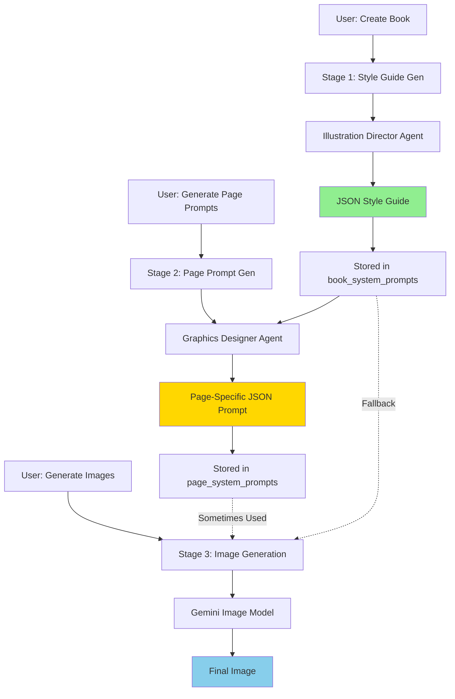
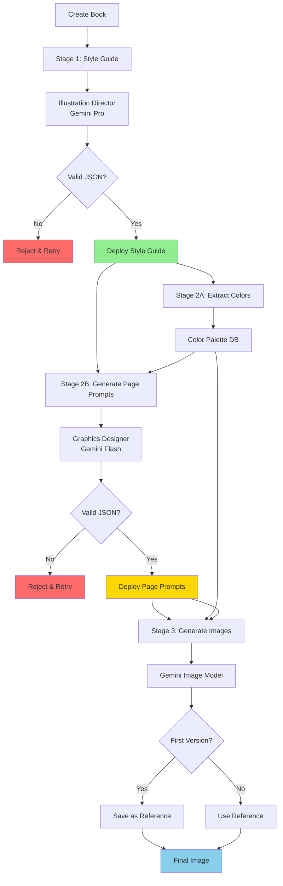

# Agentic Workflow Analysis & Recommendations

## Executive Summary

Your multi-agent ABC book generation pipeline has 3 stages but several disconnects causing inconsistency. The recent switch to Gemini models helps, but the workflow needs architectural improvements.

---

## Current Pipeline Architecture



---

## Critical Issues Identified

### 🔴 **Issue #1: Broken Workflow Chain**

**Problem:** The Graphics Designer Agent creates page prompts, but image generation doesn't consistently use them.

**Current Code (generate-page-image/index.ts:126-128):**
```typescript
const usePagePrompt = !!pagePrompt;
const systemPrompt = pagePrompt?.content || deployedPrompt?.content;
```

**Impact:** 
- Graphics Designer Agent output is sometimes ignored
- Falls back to generic book style guide
- Defeats the purpose of page-specific prompt generation

**Fix:**
```typescript
// ENFORCE page prompt usage - fail if missing
if (!pagePrompt || !pagePrompt.is_deployed) {
  throw new Error('No deployed page prompt found. Generate page prompts first.');
}
const systemPrompt = pagePrompt.content;
```

---

### 🔴 **Issue #2: Orphaned Function**

**Problem:** `generate-graphics-designer-prompt` exists but is never used in the workflow.

**Evidence:**
- Function creates Graphics Designer system prompt from style guide JSON
- But it's not called by page prompt generation or image generation
- Disconnected from actual pipeline

**Impact:**
- Wasted function maintenance
- Confusion about actual workflow
- Potential inconsistency source

**Fix:**
Either:
1. **Remove** the function entirely, OR
2. **Integrate** it to update Graphics Designer Agent instructions when style guide changes

---

### 🟡 **Issue #3: Inconsistent JSON Handling**

**Problem:** JSON extraction and validation differs across stages.

**Style Guide (robust):**
```typescript
// Multiple extraction strategies
// Markdown blocks, code blocks, largest JSON object
// Proper validation with required keys check
```

**Page Prompts (weaker):**
```typescript
// Basic JSON.parse in try-catch
// Falls back to raw text with no validation
// No schema enforcement
```

**Impact:**
- Some stages get structured data, others get text
- Color extraction may fail
- Inconsistent downstream processing

**Fix:**
Create shared JSON extraction utility in `_shared/`:
```typescript
// supabase/functions/_shared/jsonExtractor.ts
export function extractAndValidateJSON<T>(
  rawText: string, 
  validator: (data: any) => data is T,
  schema: string
): { isValid: boolean; data?: T; error?: string }
```

---

### 🟡 **Issue #4: No Color Locking**

**Problem:** Colors defined in style guide aren't enforced in later stages.

**Current Flow:**
1. Style guide defines: `primary: #FF5733`, `background: #FFFFFF`
2. Page prompt *mentions* these colors but doesn't extract/validate them
3. Image generation receives text description, not structured color data

**Impact:**
- AI model interprets colors differently each time
- "Red" might be #FF0000 or #DC143C or #8B0000
- Visual inconsistency across pages

**Fix:**
Add color extraction and enforcement:
```typescript
interface ColorPalette {
  primary: { hex: string; hsl: string };
  secondary: { hex: string; hsl: string };
  accent: { hex: string; hsl: string };
  background: { hex: string; hsl: string };
}

// Extract from style guide JSON
const colors = extractColors(styleGuideJSON);

// Inject into every prompt
const colorInstructions = `
MANDATORY COLORS (use these exact values):
- Primary: ${colors.primary.hex}
- Background: ${colors.background.hex}
Do not substitute or interpret these colors.
`;
```

---

### 🟡 **Issue #5: No Character/Object Persistence**

**Problem:** Each page generates characters independently - same letter might look different.

**Example:**
- Page A: Apple (green apple with leaf)
- User regenerates → Apple (red apple, different style)
- No reference to previous generation

**Impact:**
- Inconsistent character design
- Breaking visual continuity
- Confusing for children

**Fix:**
Implement reference image system:
```typescript
// When generating first version, save as reference
if (versionNumber === 1) {
  await saveAsReference(pageId, imageUrl);
}

// For subsequent generations, include reference
const messages = [
  { role: 'system', content: systemPrompt },
  { 
    role: 'user', 
    content: [
      { type: 'text', text: pageContent },
      { 
        type: 'image_url', 
        image_url: { url: referenceImageUrl } 
      }
    ]
  }
];
```

---

### 🟢 **Issue #6: Missing Validation Gates**

**Problem:** No validation between stages - errors cascade downstream.

**Current:** User can:
1. Generate images without style guide
2. Generate images without page prompts  
3. Deploy incomplete/invalid JSON

**Fix:**
Add validation middleware:
```typescript
// Before image generation
async function validatePrerequisites(pageId: string) {
  const book = await getBookForPage(pageId);
  
  if (!book.hasDeployedStyleGuide) {
    throw new ValidationError('Generate style guide first');
  }
  
  const pagePrompt = await getDeployedPagePrompt(pageId);
  if (!pagePrompt) {
    throw new ValidationError('Generate page prompt first');
  }
  
  if (!isValidJSON(book.styleGuide)) {
    throw new ValidationError('Style guide JSON is invalid');
  }
  
  return { book, pagePrompt };
}
```

---

## Recommended Architecture

### ✅ **Enhanced Pipeline (Sequential & Enforced)**



---

## Implementation Roadmap

### **Phase 1: Fix Critical Issues (1-2 days)**

1. **Enforce page prompt usage** in image generation
2. **Remove or integrate** graphics-designer-prompt function  
3. **Add validation gates** at each stage
4. **Create shared JSON utilities**

### **Phase 2: Add Color Locking (2-3 days)**

1. **Create color extraction** from style guide JSON
2. **Store color palette** in dedicated DB table
3. **Inject color instructions** into every prompt
4. **Validate color usage** in generated content

### **Phase 3: Character Persistence (3-4 days)**

1. **Save first image** as reference for each page
2. **Include reference image** in subsequent generations
3. **Add character library** feature
4. **Enable cross-page character reuse**

### **Phase 4: Enhanced Monitoring (1-2 days)**

1. **Add consistency scoring** across pages
2. **Visual diff tools** for version comparison
3. **Automated quality checks**
4. **Rollback capabilities**

---

## Specific Code Changes Needed

### 1. Create Color Extraction Service

```typescript
// supabase/functions/_shared/colorExtractor.ts
export interface ExtractedColors {
  primary: { hex: string; hsl: string; usage: string };
  secondary: { hex: string; hsl: string; usage: string };
  accent: { hex: string; hsl: string; usage: string };
  background: { hex: string; hsl: string; usage: string };
}

export function extractColorsFromStyleGuide(
  styleGuideJSON: any
): ExtractedColors | null {
  if (!styleGuideJSON?.colorPalette) return null;
  
  const palette = styleGuideJSON.colorPalette;
  
  return {
    primary: {
      hex: palette.primary?.hex || '#000000',
      hsl: palette.primary?.hsl || 'hsl(0, 0%, 0%)',
      usage: palette.primary?.usage || 'main elements'
    },
    // ... similar for secondary, accent, background
  };
}
```

### 2. Update Image Generation Function

```typescript
// In generate-page-image/index.ts

// BEFORE AI call, extract and enforce colors
const styleGuideJSON = JSON.parse(deployedPrompt.content);
const colors = extractColorsFromStyleGuide(styleGuideJSON);

if (!colors) {
  throw new Error('Failed to extract colors from style guide');
}

const colorEnforcement = `
🎨 MANDATORY COLOR PALETTE (use these exact hex values):
- Primary: ${colors.primary.hex} (${colors.primary.usage})
- Secondary: ${colors.secondary.hex} (${colors.secondary.usage})  
- Accent: ${colors.accent.hex} (${colors.accent.usage})
- Background: ${colors.background.hex} (${colors.background.usage})

CRITICAL: These are not suggestions. Use these exact colors.
`;

const messages = [
  { role: 'system', content: systemPrompt + '\n\n' + colorEnforcement },
  { role: 'user', content: pageContent }
];
```

### 3. Add Database Migration for Color Palette

```sql
-- Add color_palette table for structured color storage
CREATE TABLE IF NOT EXISTS color_palettes (
  id UUID DEFAULT gen_random_uuid() PRIMARY KEY,
  book_id UUID NOT NULL REFERENCES books(id) ON DELETE CASCADE,
  style_guide_id UUID REFERENCES book_system_prompts(id),
  primary_hex TEXT NOT NULL,
  primary_hsl TEXT NOT NULL,
  secondary_hex TEXT NOT NULL,
  secondary_hsl TEXT NOT NULL,
  accent_hex TEXT NOT NULL,
  accent_hsl TEXT NOT NULL,
  background_hex TEXT NOT NULL,
  background_hsl TEXT NOT NULL,
  text_hex TEXT NOT NULL,
  text_hsl TEXT NOT NULL,
  is_active BOOLEAN DEFAULT true,
  created_at TIMESTAMP WITH TIME ZONE DEFAULT NOW(),
  updated_at TIMESTAMP WITH TIME ZONE DEFAULT NOW()
);

-- Index for quick lookups
CREATE INDEX idx_color_palettes_book_active ON color_palettes(book_id, is_active);
```

### 4. Add Reference Image System

```sql
-- Add reference image tracking
CREATE TABLE IF NOT EXISTS page_reference_images (
  id UUID DEFAULT gen_random_uuid() PRIMARY KEY,
  page_id UUID NOT NULL REFERENCES pages(id) ON DELETE CASCADE,
  book_id UUID NOT NULL REFERENCES books(id) ON DELETE CASCADE,
  image_url TEXT NOT NULL,
  is_active BOOLEAN DEFAULT true,
  created_at TIMESTAMP WITH TIME ZONE DEFAULT NOW(),
  UNIQUE(page_id, is_active) -- Only one active reference per page
);
```

---

## Quality Metrics to Track

### Consistency Scoring
```typescript
interface ConsistencyMetrics {
  colorVariance: number;      // 0-100, lower is better
  styleDeviation: number;     // 0-100, lower is better  
  characterSimilarity: number; // 0-100, higher is better
  overallScore: number;       // 0-100, higher is better
}
```

### Monitoring Dashboard
- **Pipeline Success Rate**: % of runs completing all stages
- **JSON Validation Rate**: % of valid JSON outputs
- **Regeneration Rate**: How often users regenerate (indicates quality issues)
- **Color Consistency**: Variance in hex values across pages
- **Average Generation Time**: Per stage and total

---

## Expected Improvements

### After Phase 1 (Critical Fixes)
- ✅ No more fallback to wrong prompts
- ✅ Clear error messages when prerequisites missing
- ✅ Consistent JSON handling across stages

### After Phase 2 (Color Locking)  
- ✅ Exact color matching across all pages
- ✅ No more color interpretation variance
- ✅ Professional brand consistency

### After Phase 3 (Character Persistence)
- ✅ Recognizable characters across pages
- ✅ Visual continuity throughout book
- ✅ Reduced regeneration needs

### After Phase 4 (Monitoring)
- ✅ Proactive quality detection
- ✅ Data-driven improvements
- ✅ Easy rollback and recovery

---

## Conclusion

Your agentic workflow has a solid foundation but needs **architectural enforcement** rather than just model changes. The key improvements are:

1. **Enforce sequential dependencies** - don't allow skipping stages
2. **Lock critical parameters** - colors, character designs, style elements
3. **Validate at every gate** - reject invalid outputs immediately
4. **Persist references** - use previous generations to guide new ones
5. **Monitor continuously** - track consistency metrics over time

The recent Gemini migration helps with model consistency, but the workflow logic needs these structural improvements to achieve true visual consistency.
