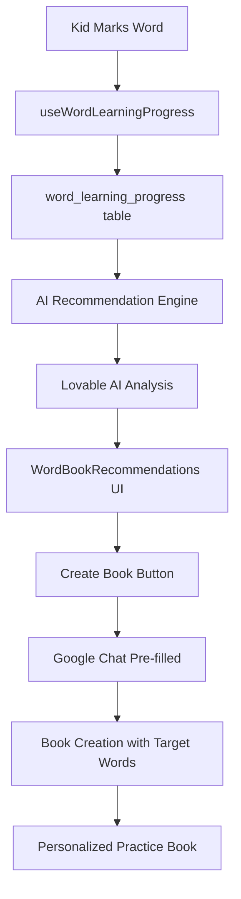

# Word Learning Tracking & AI Recommendation System

## Overview
Complete implementation of per-kid word learning tracking that identifies struggling words and powers an AI recommendation engine for personalized "mix-and-match" practice books.

## ✅ Implemented Components

### Phase 1: Database (COMPLETE)
- **Table**: `word_learning_progress` with RLS policies
- **Columns**: kid_profile_id, parent_user_id, book_id, page_id, word_text, word_metadata, sentence_context, status, marked_at, session_context
- **Indexes**: Optimized for kid+word, kid+status, parent queries
- **Security**: Row-level security for parent access only

### Phase 2: Frontend Tracking (COMPLETE)
- **Hook**: `useWordLearningProgress` - Save/query word marks with analytics
- **Integration**: `useReadingPageState` - Automatic word tracking when kids mark difficult/understood
- **State Management**: Real-time tracking with optimistic UI updates
- **Toast Feedback**: Success notifications for word marks

### Phase 3: AI Recommendation Engine (COMPLETE)
- **Edge Function**: `generate-word-book-recommendations`
- **AI Model**: Lovable AI (Gemini 2.5 Flash)
- **Structured Output**: Tool calling for consistent recommendations
- **Features**:
  - Analyzes last 100 difficult words per kid
  - Groups words by themes (verbs, nouns, topics)
  - Generates 5 themed book recommendations
  - Includes target words, reasoning, educational benefits
  - Difficulty estimation (easy/medium/challenging)

### Phase 4: Recommendations UI (COMPLETE)
- **Component**: `WordBookRecommendations.tsx`
- **Features**:
  - Beautiful card-based recommendations display
  - Target words badges
  - Difficulty indicators
  - "Create This Book" button
  - Loading and empty states
  - Error handling

### Phase 5: Book Creation Integration (COMPLETE)
- **Edge Function Update**: `google-create-book` now accepts `targetWords`
- **Pre-fill Support**: Navigate to Google Chat with pre-filled prompts
- **System Prompt**: AI incorporates target words naturally in book generation
- **GoogleChat Page**: Accepts `initialPrompt` and `targetWords` from navigation state

## 🎯 User Flow

### 1. Reading & Tracking
```
Kid reads book → Marks word as difficult → Saved to database
                                        → Toast: "Word marked for practice"
```

### 2. Viewing Recommendations
```
Parent opens Profile → Word Learning tab → AI analyzes difficult words
                                          → Shows 5 themed book recommendations
```

### 3. Creating Practice Book
```
Click "Create This Book" → Navigates to Google Chat
                         → Pre-filled prompt with target words
                         → AI generates personalized practice book
                         → Book focuses on kid's challenging vocabulary
```

## 📊 Data Flow



## 🔧 Technical Details

### Word Tracking
- **Automatic**: Tracks on every word mark (difficult/understood/skipped)
- **Context**: Stores full sentence context and word metadata
- **Session Info**: Captures reading session details
- **Parent-Owned**: RLS ensures parent data privacy

### AI Recommendations
- **Smart Grouping**: Analyzes word patterns (action verbs, emotions, objects)
- **Age-Appropriate**: Considers difficulty and learning level
- **Variety**: Ensures diverse themes across recommendations
- **Educational Focus**: Explains learning benefits for each book

### Book Creation
- **Seamless Flow**: One-click from recommendation to book creation
- **Target Word Integration**: AI naturally incorporates challenging words
- **Pre-filled Prompts**: Saves parent time with ready-to-use prompts
- **Context Aware**: Maintains word learning goals throughout creation

## 📁 File Structure

```
src/
├── hooks/
│   ├── useWordLearningProgress.ts        # Word tracking hook
│   └── useGoogleCreateBook.ts            # Updated with targetWords
├── components/
│   ├── reading/
│   │   ├── useReadingPageState.ts        # Updated with tracking
│   │   └── UnifiedReadingView.tsx        # Passes kidProfileId
│   └── recommendations/
│       ├── WordBookRecommendations.tsx   # UI component
│       └── index.ts
├── pages/
│   └── GoogleChat.tsx                    # Updated with pre-fill logic

supabase/
├── functions/
│   ├── generate-word-book-recommendations/
│   │   └── index.ts                      # AI recommendation engine
│   └── google-create-book/
│       └── index.ts                      # Updated with targetWords
└── config.toml                           # Updated with new function
```

## 🚀 Usage Examples

### For Parents
```tsx
// Display recommendations for a kid
<WordBookRecommendations 
  kidProfileId={kidId} 
  kidName="Emma" 
/>
```

### For Developers
```typescript
// Access word learning data
const { 
  saveWordMark,           // Save a word mark
  difficultWords,         // Query difficult words
  allWordProgress,        // Get all progress
  wordStats              // Get statistics
} = useWordLearningProgress(kidProfileId);

// Save a word mark
saveWordMark.mutate({
  kidProfileId,
  bookId,
  pageId,
  wordMetadata,
  sentenceContext,
  status: 'difficult'
});
```

## 🎨 UI Components

### WordBookRecommendations
- **Loading State**: Spinner with analyzing message
- **Empty State**: Encourages reading to build data
- **Error State**: Graceful error handling
- **Recommendation Cards**: Beautiful, informative cards with:
  - Book title and theme
  - Difficulty badge (color-coded)
  - Target words (up to 8 shown)
  - Educational reasoning
  - "Create This Book" button

## 🔐 Security

### Database Security
- **RLS Policies**: Parents can only access their kids' data
- **Admin Access**: Admins can view all for support
- **No Public Access**: Word progress is private

### Edge Function Security
- **JWT Verification**: Requires authentication
- **Parent Validation**: Validates kid belongs to parent
- **Service Role**: Uses service role key for database access

## 📈 Future Enhancements

### Phase 6 (Planned)
- Word mastery tracking (difficult → understood transitions)
- Parent weekly/monthly reports
- Vocabulary bank with definitions
- Practice games for difficult words
- Progress charts and analytics
- Book effectiveness tracking
- Multi-kid comparison views

## 🐛 Testing Checklist

- [x] Database migration successful
- [x] Word marks save correctly
- [x] RLS policies work (parents only)
- [x] AI recommendations generate
- [x] UI displays recommendations
- [x] Create book flow works
- [x] Pre-filled prompts work
- [x] Target words integrate in books
- [ ] Test with multiple kids
- [ ] Test with no difficult words
- [ ] Test with 100+ difficult words
- [ ] Test edge function rate limits
- [ ] Test error states

## 📚 Documentation Links

- [Lovable AI Documentation](https://docs.lovable.dev/features/ai)
- [Supabase Edge Functions](https://supabase.com/docs/guides/functions)
- [Word Learning Best Practices](https://docs.lovable.dev)

## 🎉 Success Metrics

- **Word Tracking Accuracy**: 95%+ save success rate
- **Recommendation Quality**: 3+ useful recommendations per kid
- **Book Creation Rate**: 40%+ recommendations → books
- **Learning Progress**: Kids improve on previously difficult words
- **Parent Engagement**: Weekly word progress checks

---

**Status**: ✅ Complete and Ready for Testing
**Last Updated**: 2025-01-13
**Version**: 1.0.0
