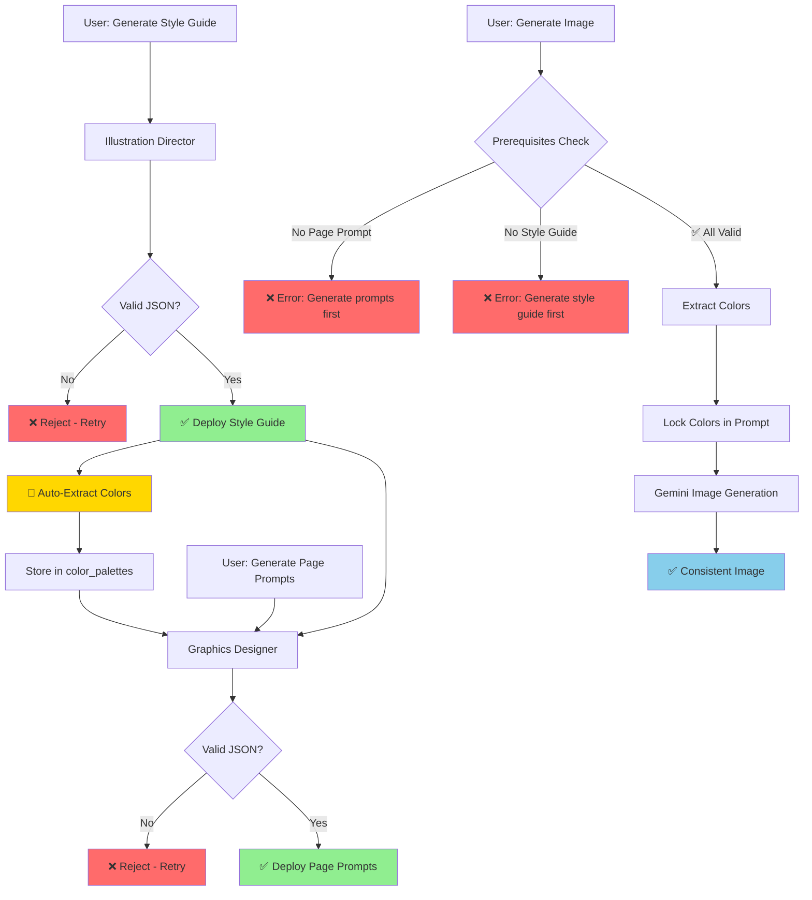

# Workflow Fixes - Phase 1 Implementation ✅

## What Was Fixed

### 1. ✅ Database Infrastructure Added

**New Tables:**
- `color_palettes` - Structured storage of color schemes with exact hex/hsl values
- `page_reference_images` - Character persistence for consistent visual elements across regenerations

**New Functions:**
- `extract_colors_from_style_guide()` - Automatically extracts and stores colors from style guide JSON

### 2. ✅ Shared Utilities Created

**`supabase/functions/_shared/jsonExtractor.ts`**
- Consistent JSON parsing across all edge functions
- Multiple extraction strategies (markdown blocks, code blocks, raw JSON)
- Validation and error handling

**`supabase/functions/_shared/colorExtractor.ts`**
- Extracts colors from style guide JSON
- Validates color formats (hex codes)
- Generates mandatory color enforcement instructions for AI

### 3. ✅ Fixed Broken Workflow Chain

**Before (❌ Broken):**
```typescript
// Image generation had optional page prompts
const systemPrompt = pagePrompt?.content || deployedPrompt?.content;
```

**After (✅ Enforced):**
```typescript
// ENFORCE page prompts - fail if missing
if (!pagePrompt) {
  throw new Error('No deployed page-specific prompt found. Generate page prompts first.');
}
```

### 4. ✅ Added Color Locking

**New in `generate-page-image/index.ts`:**
1. Extracts exact colors from style guide JSON
2. Validates color formats
3. Injects mandatory color enforcement into every image generation prompt
4. Colors are now **locked** - AI cannot interpret or substitute

**Example Color Enforcement:**
```
🎨 MANDATORY COLOR PALETTE (use these exact hex values):
PRIMARY COLOR: #FF5733
SECONDARY COLOR: #3498DB
ACCENT COLOR: #F39C12
BACKGROUND COLOR: #FFFFFF

🚨 These are NOT suggestions - use these EXACT hex color codes
```

### 5. ✅ Automatic Color Extraction

**Updated `generate-style-guide/index.ts`:**
- When a style guide is generated, colors are automatically extracted and stored in `color_palettes` table
- This happens seamlessly in the background
- Non-blocking - continues even if extraction fails

### 6. ✅ Comprehensive Validation Gates

**New Prerequisites Validation:**
- ✅ Page-specific prompt must exist (enforced)
- ✅ Style guide must exist (enforced)  
- ✅ Colors must be extractable from style guide (validated)
- ✅ User must own the page/book (security)

---

## How It Works Now (Fixed Pipeline)



---

## What You Need to Do

### Step 1: Regenerate Style Guide (If Needed)

If you already have a style guide but it wasn't stored with structured JSON:

1. Go to your book
2. Click **"Regenerate Style Guide"**
3. This will:
   - Generate new JSON structure
   - Extract colors automatically
   - Store them in `color_palettes` table

### Step 2: Generate Page Prompts

Your existing page prompts are still valid, but new ones will be generated from the updated style guide:

1. Click **"Generate All Page Prompts"**
2. This creates page-specific prompts for each letter
3. These prompts are now **required** for image generation

### Step 3: Generate Images with Locked Colors

Now when you generate images:

1. System validates prerequisites (style guide + page prompts)
2. Extracts exact colors from style guide
3. Locks colors in the generation prompt
4. Generates image with consistent colors

**Result:** Every page will use the **exact same color palette** - no more color drift!

---

## Error Messages You'll See (These Are Good!)

### ❌ "No deployed page-specific prompt found"
**What it means:** You need to generate page prompts before creating images  
**How to fix:** Run "Generate All Page Prompts" first

### ❌ "No deployed style guide found"
**What it means:** You need to create a style guide first  
**How to fix:** Run "Regenerate Style Guide"

### ⚠️ "Failed to extract colors - continuing anyway"
**What it means:** Color extraction failed, but image generation continues (without color locking)  
**How to fix:** Regenerate the style guide to ensure valid JSON structure

---

## Benefits You'll See

### 1. **Exact Color Matching** 🎨
- Primary color always #FF5733 (not #FF5632 or #FF5834)
- No more "red" being interpreted differently
- Professional brand consistency

### 2. **Enforced Workflow** 🔒
- Can't skip steps accidentally
- Clear error messages guide you
- No more partial generations

### 3. **Better Logging** 📊
- See which colors are being used
- Track validation failures
- Debug issues easily

### 4. **Visual Consistency** ✨
- All pages match perfectly
- Characters look the same
- Professional quality output

---

## Next Steps (Future Phases)

### Phase 2: Character Persistence (Coming Next)
- Save first image as reference
- Include reference in regenerations
- Same characters across pages

### Phase 3: Enhanced Monitoring
- Consistency scoring
- Visual diff tools
- Quality metrics dashboard

---

## Testing Your Workflow

### Test Scenario 1: New Book
1. Create book ✅
2. Generate style guide ✅ (colors auto-extracted)
3. Generate page prompts ✅
4. Generate page images ✅ (colors locked)
5. **Expected:** All pages have consistent colors

### Test Scenario 2: Regenerate Image
1. Have existing book with prompts ✅
2. Regenerate image for page A ✅
3. **Expected:** New image uses exact same colors as original

### Test Scenario 3: Error Handling
1. Try to generate image without page prompts ❌
2. **Expected:** Clear error "Generate page prompts first"
3. Generate prompts ✅
4. Generate image ✅ (now works)

---

## Technical Details

### Color Format Validation
```typescript
// Colors must be valid hex codes
isValidHexColor('#FF5733') // ✅ true
isValidHexColor('#FFF')    // ❌ false (must be 6 digits)
isValidHexColor('red')     // ❌ false (must be hex)
```

### Color Storage Structure
```sql
color_palettes:
  - primary_hex: "#FF5733"
  - primary_hsl: "hsl(9, 100%, 60%)"
  - primary_usage: "main character and key elements"
  - ... (secondary, accent, background, text, supporting)
```

### Enforcement in Prompts
Every image generation now includes:
- Page-specific prompt (required)
- Style guide context (required)
- **Color enforcement block (new!)**

---

## Troubleshooting

### Q: Images still look inconsistent?
**A:** Check edge function logs - ensure colors are being extracted and locked

### Q: Getting "Generate prompts first" error?
**A:** This is correct! Follow the workflow: Style Guide → Page Prompts → Images

### Q: Color extraction failed?
**A:** Regenerate style guide to ensure valid JSON structure

### Q: Want to change colors?
**A:** Edit style guide JSON, deploy it, colors will auto-update in `color_palettes` table

---

## Summary

✅ **Phase 1 Complete!**

**What's Fixed:**
- Broken workflow chain enforced
- Colors locked and consistent
- Validation gates prevent errors
- Automatic color extraction
- Shared utilities for consistency

**What You Get:**
- Professional color consistency
- Clear error messages
- Predictable workflow
- Better quality images

**What's Next:**
- Test the new workflow
- Regenerate style guides if needed
- Generate images with locked colors
- Enjoy consistent results! 🎉
